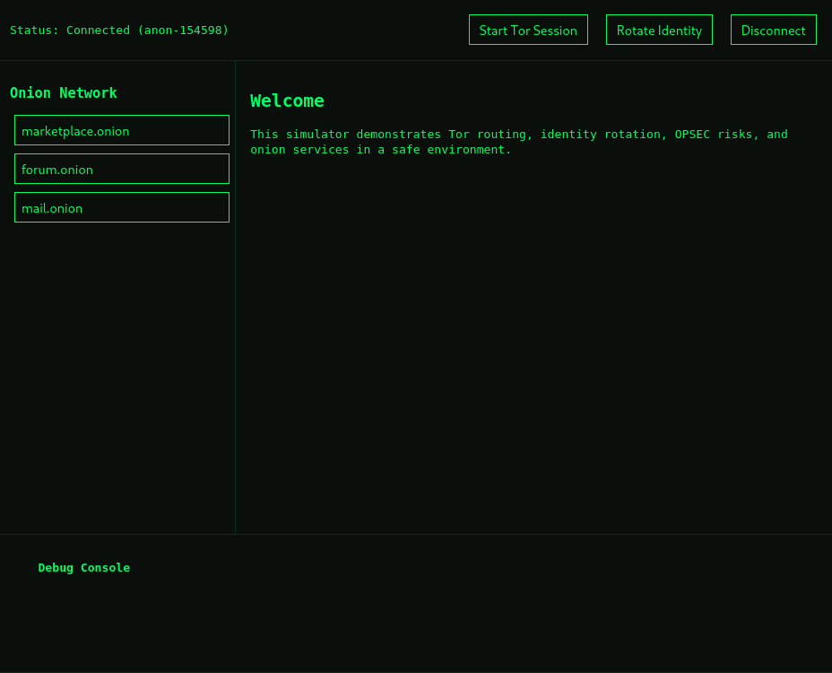
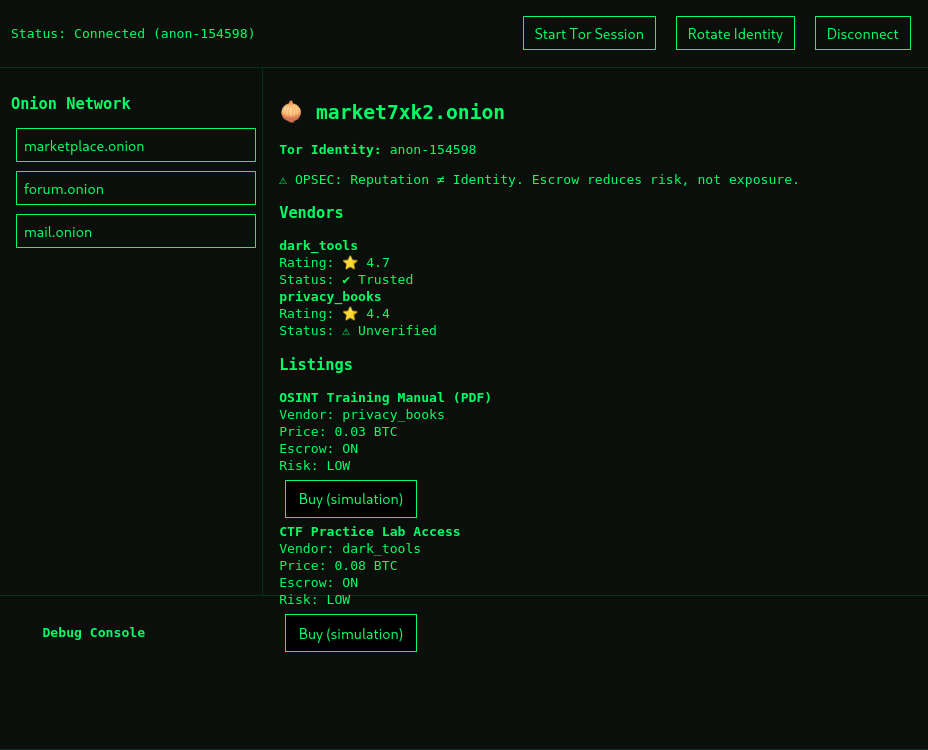

# Onion Browser Simulator

An educational **Tor Onion Browser Simulator** built to demonstrate how Tor sessions,
identity rotation, OPSEC risks, and onion services operate in a safe and controlled
environment.

This project focuses on **security concepts and system behavior**, not real Tor usage
or illegal activity.

---

## 🚀 Features

- Simulated Tor session lifecycle (connect, rotate identity, disconnect)
- Tor circuit visualization (entry, middle, exit nodes)
- OPSEC warnings based on user behavior and navigation patterns
- Integrated onion services:
  - **Marketplace** — reputation, escrow, and risk modeling
  - **Forum** — anonymous discussions and timing-correlation concepts
  - **Mail** — identity-bound encrypted messaging (simulated)
- Single Page Application (SPA) architecture for seamless navigation

---

## 🛠 Tech Stack

- **Backend:** FastAPI (Python)
- **Frontend:** Vanilla JavaScript, HTML, CSS
- **Architecture:** REST API + SPA frontend

---

## 🎯 Project Purpose

This project is designed for **educational and demonstration purposes only**.

It helps explain:
- How Tor identities behave across services
- Why identity reuse is risky
- How OPSEC mistakes can lead to correlation attacks
- How onion services differ from surface web applications

No real Tor traffic is generated.

---

## ▶️ How to Run

### Backend
```bash
cd backend
uvicorn main:app

## Screenshots

### Tor Connected Session


### Marketplace Onion Service


### Forum Onion Service


